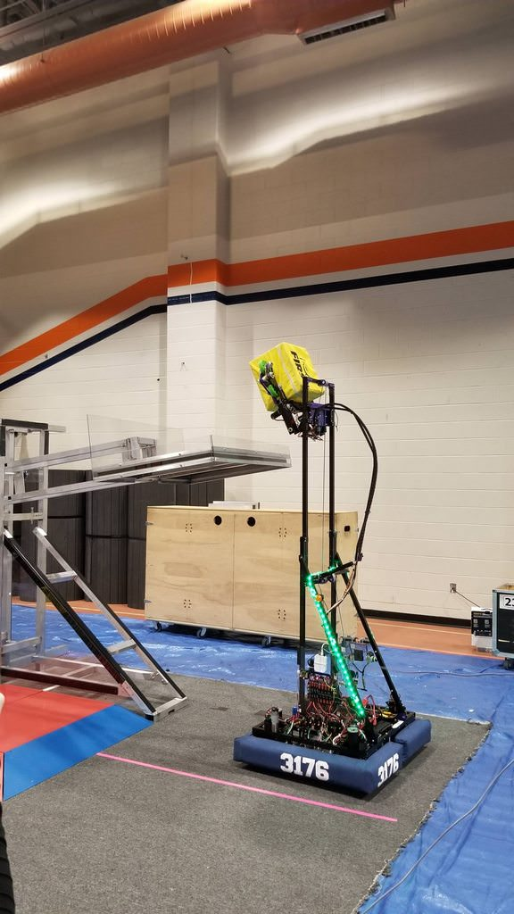

# Team 3176 FIRST Robotics Competition

The following code was written for the team's 2018 robot, Project Crab. 

Features of Project X include: 

- Swerve Drive
   - Field Centric Control 
   - Defensive Locking Position
- Vision Streaming
   - Bandwidth Management
- Trapezoidal Motion Profiling 
   - Custom auton commands
   - Accurate up to ~0.5"
- Arduino LED Routines

For any questions regarding the code, contact one of the following: 
- Harrison McCarty (mccarth@purdue.edu) - Programmer from 2018
- Team 3176 (team3176@brownsburg.k12.in.us)
